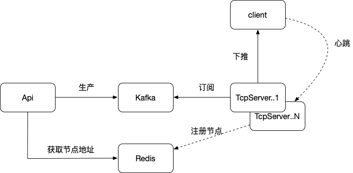

### 项目介绍 ###
一个简洁的im通讯系统；




#### 项目结构 ####
```
smart-im
 ├── api 网关接口
 ├── core 核心组件
 ├── service 业务处理
 └── tcpserver 长连接通信服务

api: 
    1. 获取tcpserver连接地址
    2. 投递消息：p2p消息（自定义业务消息）、广播消息（评论、公告、进场）
    3. 获取运行数据：在线人数

core: 
    1. 权限认证封装
    2. api限流组件
    3. api参数校验组件
    4. api请求日志组件
    5. api异常处理组件
    6. redis api
    7. mysql api

service:
    1.业务逻辑层，供api、tcpserver依赖

tcpserver:
    1.长连接通道
```


#### 接口列表 ####
|名称   | url  |
|:-----|:-----|
| 获取tcp服务地址 | /v1/smart-im/dispatch/connect_address |
| 投递IM消息| /v1/smart-im/message/send |
| 获取运行数据| /v1/smart-im/data/summary |


#### 已开发的组件 ####
1. 参数校验：ParamDesc中range支持 int、long、float、double、string
2. 异常框架：接口增加debug=true参数可以返回，抛异常时写入的附加参数
3. 限流组件：QpsCounter采用滑动窗口算法实现；通过包扫描初始化，经过Interceptor进行校验
4. tcp服务发现：通过zk实现


#### 待开发部分 ####
1. 在线数据：TcpServer在线人数上报；在线数据获取接口；进出场事件消息；
2. 限流组件：api接口限流（已完成）；tcp建连限流
3. 监控采集：采集系统qps、rt、tcp_connections等数据上报到Prometheus
4. tcp节点负载均衡算法优化


#### docker脚本 ####
```
smart-im-api docker镜像编译：
docker build -t junlong5/smart-im-api:0.0.1 .
smart-im-api docker镜像启动：
docker run -d --net=host --restart=always --name=smart-im-api --privileged junlong5/smart-im-api:0.0.1
smart-im-api docker容器进入：
docker exec -it smart-im-api bash

smart-im-tcpserver docker镜像编译：
docker build -t junlong5/smart-im-tcpserver:0.0.1 .
smart-im-tcpserver docker镜像启动：
docker run -d --restart=always --name=smart-im-tcpserver --privileged junlong5/smart-im-tcpserver:0.0.1
smart-im-tcpserver docker容器进入：
docker exec -it smart-im-tcpserver bash
```


#### 参考资料 ####
1. sequence消息序列号机制： https://www.infoq.cn/article/wechat-serial-number-generator-architecture
2. 消息序列化机制：https://github.com/protostuff/protostuff
3. 限流算法：
```
https://www.cnblogs.com/xuwc/p/9123078.html
http://www.teamquest.com/pdfs/whitepaper/ldavg1.pdf
http://www.teamquest.com/pdfs/whitepaper/ldavg2.pdf
http://en.wikipedia.org/wiki/Moving_average#Exponential_moving_average
```
